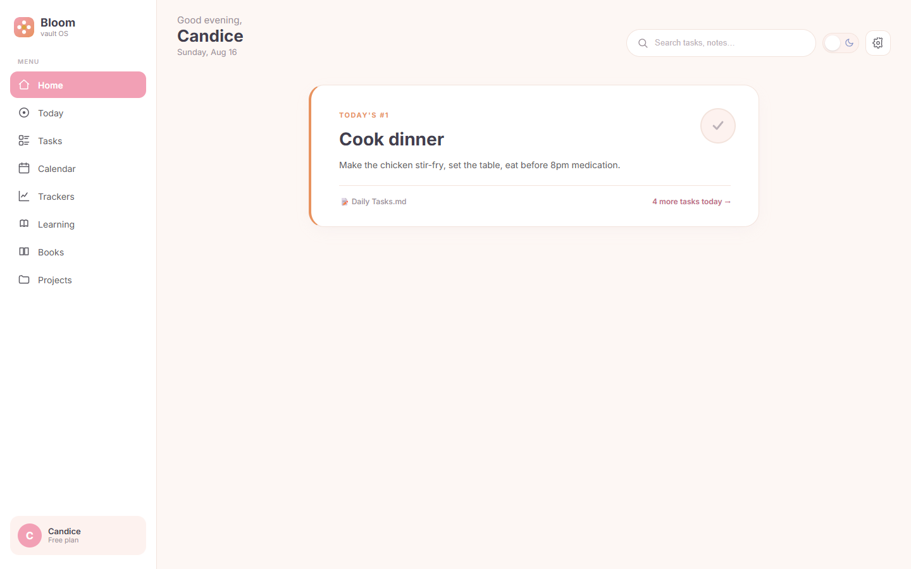
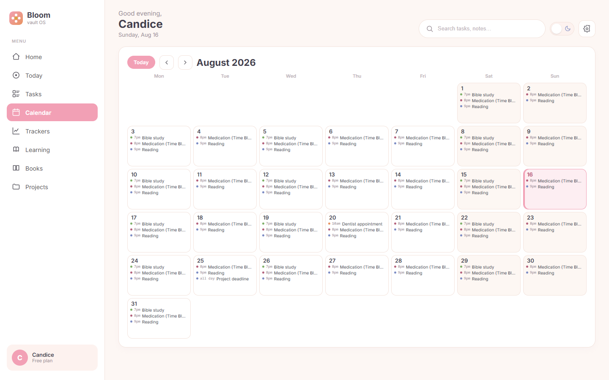
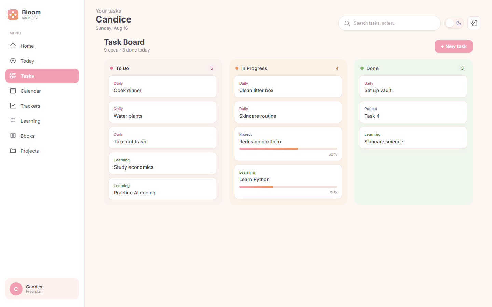
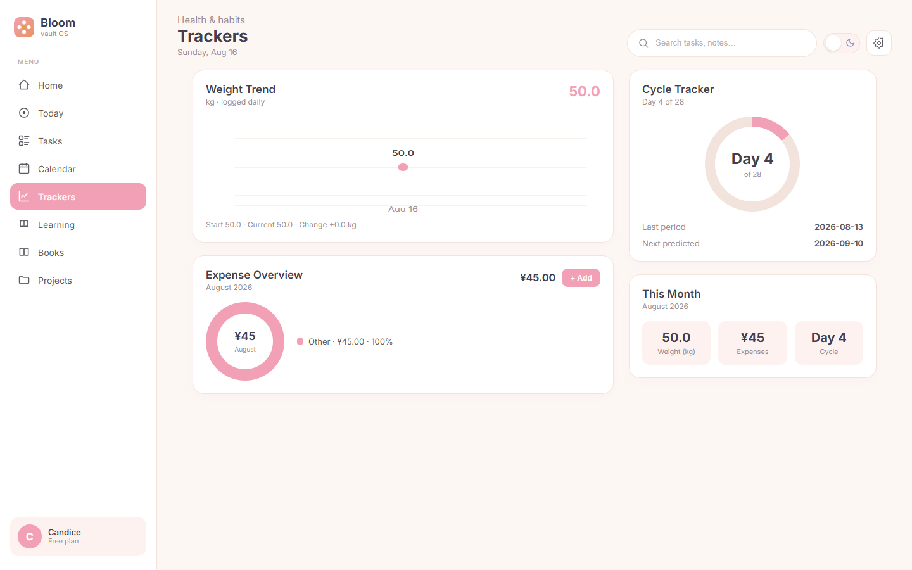

# Bloom 🌸

A soft, pastel **daily dashboard** for Obsidian — your #1 task, a task board, a lunar calendar, life trackers, study lists, and your reading shelf, all in one calm view.

> **One thing at a time.** Bloom is designed around a single-threaded day: the homepage shows exactly one card — today's most important task — instead of a wall of widgets.

| Home | Calendar |
|---|---|
|  |  |

| Tasks | Trackers |
|---|---|
|  |  |

## Features

- **Home** — a single *"Today's #1 task"* card. Tick the round button to complete it; the state is written back to your note. If your Daily Note has a `topTask` frontmatter field, it shows up here automatically.
- **Tasks** — a three-column board (To Do / In Progress / Done) that merges daily, study, and project tasks. Create tasks with **+ New task**, filter with the search box; tall columns scroll inside.
- **Calendar** — a full-month grid with **lunar dates**, **holiday banners** (statutory + commemorative, e.g. Teacher's Day), and timed events from your Daily Notes' `## ⏰ Schedule` table. Today is highlighted; jump back anytime with **Today**.
- **Trackers** — weight trend line, an expense donut with monthly total, a cycle ring, and a month summary. Log an expense with **+ Add** (date / category / item / amount) and the chart refreshes instantly.
- **Learning** — today's study tasks as a checklist; tick items or add new ones with **+ Add study task**. State is written back to the source file.
- **Books** — your reading list grouped by category (Reading / Finished / Want to read / Paused). Add a book with **+ Add book** and it lands in the right category table.
- **Settings** — light/dark theme, default landing view, and one-click *Refresh from vault*. Also available from the command palette.
- **All input is native** — every add/edit flow uses real Obsidian modals, so nothing gets swallowed by the iframe sandbox.

## Data: your notes stay the source of truth

Bloom reads and writes plain Markdown — **no database, no cloud, nothing leaves your vault**:

| View | Reads from | Writes back |
|---|---|---|
| Home | `12-Calendar/Daily Notes/<date>.md` (`topTask`) | completion state |
| Tasks | `11-Todo/*.md`, `10-Projects/Project Dashboard.md` | new tasks, checkboxes |
| Calendar | Daily Notes (`## ⏰ Schedule`) | — |
| Trackers | `13-Trackers/*.md` tables | new expense rows |
| Learning | `11-Todo/Study Tasks.md` | checkboxes, new tasks |
| Books | `15-Books/Book List.md` | new book rows |

Missing files never break the UI — affected modules simply fall back to sample data.

## Installation

### From Community Plugins
Open *Settings → Community plugins → Browse*, search for **Bloom**, and install.

### Via BRAT (beta channel)
1. Install the **BRAT** community plugin.
2. `Add a beta plugin` → paste `https://github.com/shuixiande/bloom-obsidian-plugin`.
3. Enable **Bloom** and reload.

### Manual
1. Download `main.js`, `styles.css`, `manifest.json` from the [latest release](https://github.com/shuixiande/bloom-obsidian-plugin/releases/latest).
2. Copy them into `<vault>/.obsidian/plugins/bloom/`.
3. Enable **Bloom** in *Settings → Community plugins*.

### Open the dashboard
Click the ribbon icon, or run **"Open Bloom dashboard"** from the command palette.

## Development

```bash
npm install
npm run dev     # esbuild watch
npm run build   # production build
```

- `prototype.html` — a standalone, data-stub preview that needs no Obsidian. It reuses the same `src/dashboard.ts` render layer as the plugin, so the prototype and the real plugin can never drift apart.
- `VAULT-SETUP.md` — how to build a vault that Bloom understands.

## Project structure

```
src/
  main.ts        Obsidian ItemView + plugin entry (ribbon, commands, theme)
  dashboard.ts   single render layer (shell + views) — shared by plugin & prototype
  data.ts        static fallback dataset
  vault.ts       live reader/writer (app.vault.adapter) — Obsidian only
  task-modal.ts  New-task modal (native, sandbox-safe)
  entry-modal.ts field-driven entry modal (expense / book)
  settings.ts    settings modal
esbuild.config.mjs   builds main.js (cjs) + prototype.js (iife)
manifest.json        Obsidian plugin manifest
styles.css           pastel-fresh styling + light/dark tokens
```

## License

[MIT](LICENSE) © AiteSn
